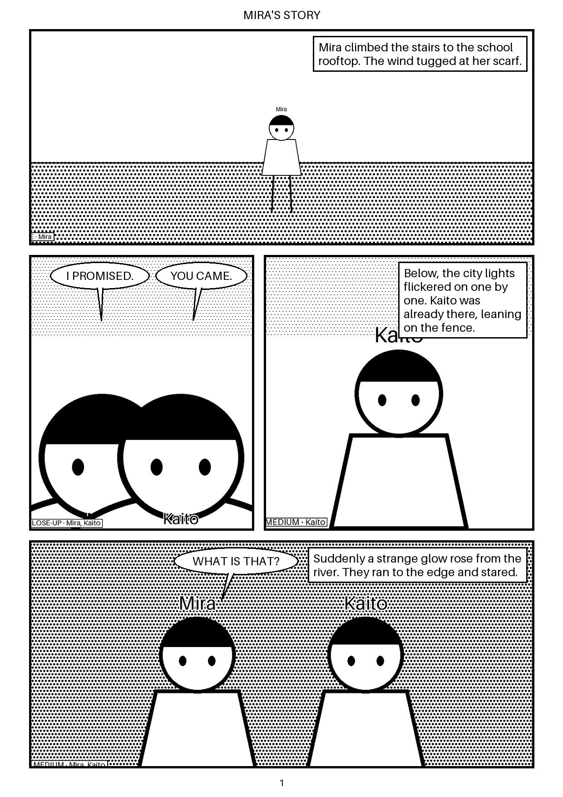

# Story to Manga

Paste a short story → get a black-and-white manga page with panels, characters and
speech bubbles, in a web reader with right-to-left reading and PNG/PDF export.



*(Sample above is **mock mode**: placeholder art drawn with Pillow. With real providers
the panels are drawn by an image model; layout and lettering stay the same.)*

## How it works

```
story ─► [1] Script (LLM) ─► [2] Character sheets ─► [3] Panel images ─► [4] Layout + lettering ─► [5] PNG + PDF
           Claude / mock        text + ref image        ComfyUI / mock       plain Pillow code
```

| Stage | Code | What happens |
|---|---|---|
| 1. Script | `backend/app/pipeline/script.py` | The LLM splits the story into pages/panels and returns **JSON matching a schema** (characters, action, setting, shot, mood, dialogue, narration). Pydantic validates it; errors are sent back to the LLM to fix (up to 3 tries). |
| 2. Characters | `pipeline/characters.py` | Each main character gets a fixed description (hair, outfit, features) and a reference image. |
| 3. Panels | `pipeline/prompts.py`, `pipeline/panels.py` | Each panel becomes an image prompt: shot + character descriptions + action + setting + mood + manga style, plus a negative prompt (no colour, no text). Generated in the shape of its layout slot. |
| 4. Layout | `pipeline/layout.py`, `pipeline/lettering.py` | Panels go into a page grid with margins, gutters and ink borders. Speech bubbles, shout bubbles and caption boxes are drawn **in code** (image models can't spell), in reading order, never covering the centre of a panel, with tails pointing at the speaker. |
| 5. Export | `pipeline/export.py` | One PNG per page + a combined PDF, for both right-to-left and left-to-right reading. |

Every job folder also contains `script.json` and `panels/prompts.json`, so you can see
exactly what the LLM wrote and what was sent to the image model.

## Quick start (mock mode, no API keys)

Requirements: Python 3.11+, Node 20+.

```bash
python scripts/tasks.py install   # or: make install
python scripts/tasks.py test      # or: make test   (all tests run in mock mode)
python scripts/tasks.py dev       # or: make dev
```

Open http://localhost:3000, click **Use sample story**, then **Make my manga**.
API docs: http://localhost:8000/docs.

Ports busy? `BACKEND_PORT=8100 FRONTEND_PORT=3100 python scripts/tasks.py dev`
(PowerShell: `$env:BACKEND_PORT=8100; $env:FRONTEND_PORT=3100; python scripts/tasks.py dev`).

Without the web app: `cd backend && .venv/Scripts/python -m app.cli ../samples/rooftop_glow.txt --out out`
(on macOS/Linux use `.venv/bin/python`).

### Docker

```bash
cp .env.example .env
docker compose up --build        # frontend :3000, backend :8000
```

## Adding API keys / switching from mock to real

All settings live in `.env` at the repo root (copy `.env.example`). `.env` is git-ignored;
keys are never logged (the health endpoint only reports *whether* a key is set).

```ini
LLM_PROVIDER=auto      # auto | mock | anthropic
IMAGE_PROVIDER=auto    # auto | mock | comfyui | hosted
ANTHROPIC_API_KEY=sk-ant-...
COMFYUI_URL=http://127.0.0.1:8188
```

`auto` uses a real provider as soon as its key/URL is set, otherwise the mock. You can
mix them, e.g. real Claude scripts with mock images. Restart the backend after editing
`.env`. The badge on the home page shows which providers are active.

- **Claude** (`providers/anthropic_llm.py`) uses the official `anthropic` SDK with
  structured outputs (`output_config.format` + JSON Schema) on `claude-opus-5-5`
  (change with `ANTHROPIC_MODEL`). Server-side refusal fallbacks are enabled.
- **ComfyUI** (`providers/comfyui_image.py`) sends a text-to-image workflow to ComfyUI's
  HTTP API (`/prompt`, `/history`, `/view`).
- **Hosted image API** (`providers/hosted_image.py`) is a stub with a generic JSON contract;
  edit `build_payload()` / `extract_image()` for your service.

## Running ComfyUI

1. Install ComfyUI (https://github.com/comfyanonymous/ComfyUI): the portable Windows
   build, or `git clone` + `pip install -r requirements.txt`. An NVIDIA GPU with 8 GB+ VRAM
   is recommended for SDXL.
2. Put a checkpoint in `ComfyUI/models/checkpoints/`. Anime/manga-tuned SDXL checkpoints
   give the best line art; `sd_xl_base_1.0.safetensors` works as a start.
3. Start it: `python main.py --listen 127.0.0.1 --port 8188` and open http://127.0.0.1:8188 to check.
4. In `.env`: `COMFYUI_URL=http://127.0.0.1:8188` and `COMFYUI_CHECKPOINT=<your file name>`
   (from Docker: `http://host.docker.internal:8188`).
5. Tune `COMFYUI_STEPS` (20–30), `COMFYUI_CFG` (5–8) and `IMAGE_BASE_SIZE`
   (≈1024 for SDXL, ≈512 for SD 1.5).

**Custom workflows:** build a graph in ComfyUI, export it with *Save (API format)*, put the
placeholders `{{prompt}}`, `{{negative_prompt}}`, `{{seed}}`, `{{width}}`, `{{height}}` and
optionally `{{reference_image}}` in the node inputs, and set `COMFYUI_WORKFLOW=path/to/file.json`.
The reference image of the panel's first character is uploaded automatically.

## AI concepts used here (short glossary)

- **Structured output**: the LLM must answer with JSON matching a schema we send, so code can use it directly. We still validate with Pydantic and feed errors back (the *repair loop*).
- **Prompt / negative prompt**: what a diffusion model should and shouldn't draw. Early words weigh more, so framing and characters come first and style comes last.
- **Seed**: the starting noise for diffusion. Same seed + prompt + settings = same image. Seeds here come from the story text, so reruns are reproducible.
- **Steps / CFG**: denoising iterations, and how strictly the model follows the prompt.
- **Character consistency**: image models don't remember earlier panels. Here we repeat the exact same description in every prompt; see next steps for stronger methods.

## Next steps for better character consistency

1. **IP-Adapter** (quickest win): feed each character's reference image into the sampler so
   the face, hair and outfit carry over. In ComfyUI, add the *IPAdapter Plus* custom nodes,
   load `{{reference_image}}` with a LoadImage node, connect it through *IPAdapter Advanced*
   (weight ≈0.6–0.8) into the KSampler's model input, and point `COMFYUI_WORKFLOW` at it. For
   panels with two or more characters, use regional prompting / attention masks so each
   reference only affects its own region.
2. **Per-character LoRA** (strongest): generate 15–30 varied images of a character (from the
   reference sheet + IP-Adapter), caption them with a trigger word such as `mira_oc`, train a
   small LoRA (kohya_ss, ~1–2k steps on SDXL), then load it with a *LoraLoader* node and put
   the trigger word in the prompt. Store the LoRA path on the character sheet.
3. **Better reference sheets**: multi-view turnarounds (front/side/back) and expression
   sheets, generated once and reused.
4. **ControlNet** (lineart / OpenPose) for poses and composition taken from rough sketches or the layout.
5. **Script-side**: ask the LLM for per-panel character positions (left/centre/right) and feed
   them both to regional prompts and to the bubble-tail placement.

## Project layout

```
backend/   FastAPI app, pipeline stages, providers, pytest tests
frontend/  Next.js reader (story form, progress, RTL reader, downloads)
samples/   sample story + generated output (mock mode)
scripts/   tasks.py: install / dev / test / sample (cross-platform)
PLAN.md · PROGRESS.md · DECISIONS.md
```

## API

| Method | Path | Description |
|---|---|---|
| POST | `/api/jobs` | `{"story": "..."}` → job (`queued`) |
| GET | `/api/jobs/{id}` | status (`queued`/`running`/`done`/`failed`), per-stage progress, result URLs |
| GET | `/api/jobs` | recent jobs |
| GET | `/api/health` | active providers |
| GET | `/files/{id}/...` | generated PNG/PDF/JSON |

Jobs run one at a time in a background thread and are kept in memory (files stay on disk
in `backend/output/`).
