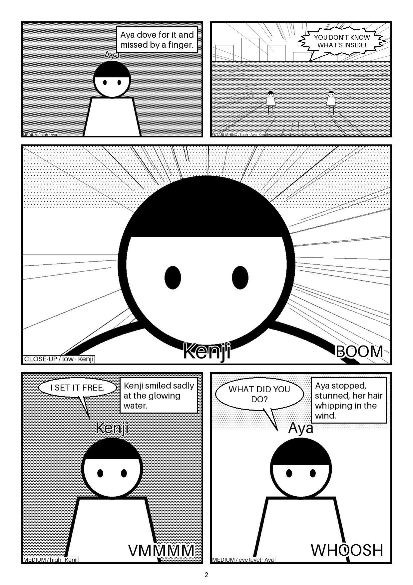

# Story to Manga

Paste a short story. A small team of AI agents turns it into black-and-white manga
pages, and you watch every step. A Writer plans beats and pages, a Director picks layouts
and camera shots, and a Character Designer writes a character bible and draws reference
sheets that you approve. Then the panels are drawn with those references (IP-Adapter),
scored for character consistency (CLIP), lettered in code, and exported as PNG and PDF.



*The sample above is **mock mode**: placeholder art drawn with Pillow, no API keys. With
ComfyUI connected, the panels come from an anime SDXL model; everything else is the same.*

## Quick start (mock mode, no keys, no GPU)

Requirements: Python 3.11+, Node 20+.

```bash
python scripts/tasks.py install   # or: make install
python scripts/tasks.py test      # or: make test    (mock mode, ~1-2 min)
python scripts/tasks.py dev       # or: make dev
```

Open http://localhost:3000, pick a sample story, and click **Make my manga**.
API docs are at http://localhost:8000/docs.

Ports busy? Set `BACKEND_PORT` / `FRONTEND_PORT`, for example
`BACKEND_PORT=8300 FRONTEND_PORT=3300 python scripts/tasks.py dev` (in PowerShell, set them
first with `$env:BACKEND_PORT=8300; $env:FRONTEND_PORT=3300`).

Optional: `pip install -r backend/requirements-ai.txt` adds real **CLIP** consistency scores
(CPU only, ~1.2 GB model download on first use). Without it, a simple pixel score is used.

## How the agents work

```
story
  │  ✎ Writer, pass 1 ─── beat sheet: beats (emotion, intensity 1-5, kind), emotional arc, climax, characters
  │  ✎ Writer, pass 2 ─── page plan: pages → panels (purpose, size, characters, action, setting,
  │                        emotion, dialogue, narration, SFX) using manga pacing rules
  │  🎬 Director ──────── a layout template per page + shot / angle / composition per panel
  │                        (+ rules enforced in code: establishing shots, close-ups on peaks, shot variety)
  │  ☺ Character Designer ─ character bible: fixed visual tags, age, body, personality, expressions
  │  🖼 Reference sheets ─ turnaround (front/side/back) + 5 expressions per main character, fixed seeds
  │  ⏸ Cast approval ──── you approve / edit / regenerate (or auto-approve), then the job resumes
  │  ✚ Prompt builder ─── manga prompt + negative prompt per panel (shot/angle tags, exact character tags)
  │  🖌 Panels ─────────── ComfyUI + IP-Adapter with the matching character reference, one at a time
  │  ≈ Consistency ────── CLIP similarity between each panel and its characters' references
  │  ▦ Layout + lettering ─ template layout, balloons, captions, SFX (plain Pillow code, no AI)
  ▼  ⇩ Export ─────────── PNG per page + PDF, right-to-left (default) and left-to-right
```

- **Shared state.** All agents read and write one Pydantic object, `MangaProject`
  (`backend/app/agents/state.py`). It is saved to `output/<job>/project.json` after every
  step, so a job can pause for approval, survive a crash, and **resume** where it stopped.
- **The graph.** The pipeline is a [LangGraph](https://langchain-ai.github.io/langgraph/)
  state graph (`agents/graph.py`, `agents/pipeline.py`). Each node skips itself if its output
  is already in the project. A conditional edge after "approval" stops the run until the cast
  is approved.
- **Structured outputs.** Every agent must answer with JSON matching a Pydantic schema
  (`agents/schemas.py`). The schema goes to the LLM, the answer is validated, and on failure
  the validation errors are sent back for up to **2 retries** (`agents/runner.py`).
  Cross-checks such as "is this speaker in the beat sheet?" are fed back the same way.
- **Rules in code.** Things the LLM must get right every time are enforced after it answers:
  pacing (one large panel per page, splash pages alone) and the Director's camera rules
  (`agents/director.py`). Each fix is recorded in the trace.
- **Agent trace.** Every step records its inputs, output, retries, validation errors, duration,
  tokens and cost. The **Agent timeline** page shows it, along with the beat sheet (intensity
  chart), the page plan and the Director's layouts.
- **Original characters only.** Prompts forbid existing franchises, and well-known
  copyrighted character names are renamed (`agents/safety.py`).

### Layout templates

There are 10 page layouts (`pipeline/templates.py`): splash, two tiers, three tiers, big top,
classic four, four-koma, tall vertical, action burst, conversation and six-grid. Each slot has a
size class (splash/large/medium/small), so the Director can match the Writer's panel sizes
(for example, the climax goes in a large slot).

## Character consistency

Image models have no memory, so every panel is drawn from scratch. Five layers keep a
character looking the same:

1. **Fixed visual tags** in the character bible (hair, eyes, outfit, accessories, marks),
   pasted *word for word* into every prompt where the character appears.
2. **Reference sheets**: a turnaround (front/side/back) and an expression sheet
   (neutral/happy/angry/sad/surprised), drawn from **fixed seeds** stored in the bible and
   cropped into individual reference images.
3. **Your approval** on the **Cast** page, where you can edit tags, regenerate a sheet with a
   new seed, or approve. Approved casts are saved per project, so a later chapter
   (`project_id`) reuses the same characters.
4. **IP-Adapter**: when drawing a panel, ComfyUI receives the character's reference image.
   It picks the expression that matches the panel's emotion, otherwise the front view.
   The weight is configurable (`IPADAPTER_WEIGHT`, default 0.7). Two characters get two
   references at reduced weight (see the limitation in DECISIONS.md #40).
5. **A consistency score**: the CLIP image-embedding similarity between each panel and its
   characters' references, shown next to every panel in the reader. As a rough guide, ≥0.85
   means the same look and <0.70 means the character has probably drifted. This is
   groundwork for a future editor agent that redraws drifted panels.

## Providers: from mock to real

Settings live in `.env` at the repo root (copy `.env.example`; `.env` is git-ignored and
keys are never logged).

**LLM** (`LLM_PROVIDER=auto` picks the first one configured):

| Priority | Provider | Set in `.env` |
|---|---|---|
| 1 | Anthropic Claude (official SDK, structured outputs, `claude-opus-5-5`) | `ANTHROPIC_API_KEY` |
| 2 | Google Gemini (REST, JSON-schema mode) | `GEMINI_API_KEY` (+ `GEMINI_MODEL`) |
| 3 | Any OpenAI-compatible server (OpenAI, Ollama, LM Studio, vLLM, OpenRouter…) | `OPENAI_BASE_URL` + `OPENAI_API_KEY` (+ `OPENAI_MODEL`) |
| – | Mock (deterministic, offline) | nothing |

Tokens and cost are counted per job and shown in the timeline. Unknown models count as $0
unless you set `LLM_INPUT_PRICE_PER_MTOK` / `LLM_OUTPUT_PRICE_PER_MTOK`.

**Images** (`IMAGE_PROVIDER=auto`): **ComfyUI** whenever it answers at `COMFYUI_URL`
(default `http://127.0.0.1:8188`), otherwise mock. There is also a stub for a hosted image
API (`providers/hosted_image.py`).

## Running ComfyUI (real images, 8 GB GPU)

ComfyUI wasn't installed on the build machine. Follow **[SETUP_COMFYUI.md](SETUP_COMFYUI.md)**,
which covers the portable Windows build, the IP-Adapter custom nodes, and the three model
downloads (Animagine XL 3.1, IP-Adapter Plus SDXL, CLIP-ViT-H). Then check the connection:

```bash
cd backend
.venv/Scripts/python -m app.tools.comfy_check             # lists installed nodes and models
.venv/Scripts/python -m app.tools.comfy_check --generate  # one real 832x1216 test panel -> samples/
```

The app reads `/object_info` and only uses nodes that exist. Without IP-Adapter it falls back
to plain text-to-image and shows a warning. Workflows are JSON templates in
`backend/workflows/` with `{{placeholders}}` filled in code. To fit in 8 GB, it uses one
checkpoint, draws panels sequentially, calls `/free` between stages, works at about
832×1216, and runs CLIP on the CPU.

## The web app

- **Home**: paste a story or pick one of three samples (action, drama, comedy). Choose
  auto-approve for unattended runs, or continue an earlier project to reuse its cast.
- **Progress**: live per-stage progress across 10 stages.
- **Agent timeline**: each agent's work, retries, rule fixes, tokens and cost, plus the beat
  sheet, page plan and Director decisions (with layout thumbnails).
- **Cast**: the bible and sheets for each main character, with **New seed**, **Edit**,
  **Approve** and **Approve all & draw panels**.
- **Read**: the manga reader (right-to-left by default, toggle for left-to-right, arrow keys),
  PNG and PDF downloads, and a panel gallery with prompts, seeds, IP-Adapter references and
  consistency scores.

## Command line and samples

```bash
cd backend
.venv/Scripts/python -m app.cli ../samples/stories/drama_last_lighthouse.txt --out ../samples/output/drama
python scripts/tasks.py sample     # (from the repo root) re-runs all samples/stories/*.txt
```

`samples/output/<story>/` holds the committed results of the three sample stories (mock LLM
and mock images, real CLIP scores): `project.json`, character sheets and crops, panels, pages
and PDFs.

## Tests

```bash
python scripts/tasks.py test                      # all unit tests, mock mode, no GPU/keys
RUN_SLOW=1 python -m pytest tests/test_consistency.py   # (in backend/) real CLIP test
python -m pytest tests/test_integration.py -s           # (in backend/) real end-to-end run
```

The integration test skips itself unless ComfyUI is reachable or an LLM key is set. It uses
whatever is available and writes its output to `samples/integration_output/`.

## API

| Method | Path | |
|---|---|---|
| POST | `/api/jobs` | `{"story", "auto_approve"?, "project_id"?}` → job |
| GET | `/api/jobs/{id}` | status (queued/running/awaiting_approval/done/failed), stage progress, result |
| GET | `/api/jobs/{id}/project` | full agent state (trace, beat sheet, plans, cast, prompts, panels) |
| POST | `/api/jobs/{id}/approve` | approve the whole cast and continue |
| POST | `/api/jobs/{id}/characters/{name}/approve` | `{"approved": bool}` |
| POST | `/api/jobs/{id}/characters/{name}/regenerate` | `{"sheet": "turnaround"\|"expressions"\|"both"}` (new seed) |
| PATCH | `/api/jobs/{id}/characters/{name}` | edit description / visual tags |
| GET | `/api/layouts`, `/api/samples`, `/api/projects`, `/api/health` | layout library, sample stories, saved casts, providers |
| GET | `/files/{id}/...` | generated files |

## Docker

```bash
cp .env.example .env
docker compose up --build                   # WITH_CLIP=1 docker compose up --build  for CLIP scores
```

ComfyUI stays on the host (it needs the GPU); set `COMFYUI_URL=http://host.docker.internal:8188`.

## Project layout

```
backend/app/agents/     writer, director, character designer, prompt builder, sheets, graph, state, runner
backend/app/comfy/      ComfyUI client (+ /object_info discovery) and workflow template injection
backend/app/providers/  LLM (anthropic, gemini, openai-compatible, mock) + image (comfyui, hosted, mock)
backend/app/pipeline/   layout templates, layout, lettering, export
backend/app/vision/     CLIP consistency score
backend/workflows/      ComfyUI workflow templates (JSON)
frontend/               Next.js: home, progress, agent timeline, cast, reader
samples/                sample stories + their generated output
PLAN.md · PHASE_1_2_PLAN.md · PROGRESS.md · DECISIONS.md · SETUP_COMFYUI.md
```

## Next steps (Phase 3 ideas)

- **Editor agent**: when a panel's consistency score is low, redraw it (new seed, higher
  IP-Adapter weight) or flag it for review.
- **Regional IP-Adapter** for multi-character panels (attention masks per character) and
  **ControlNet** (OpenPose / lineart) for poses.
- **A per-character LoRA**, trained from the approved sheets, for the strongest consistency.
- Persistent jobs (SQLite) and cancellation; streaming agent progress over SSE.

## AI glossary

- **Agent**: an LLM call with a role, instructions and a strict output format. Several
  agents hand work to each other through the shared state.
- **Structured output**: the LLM must return JSON in a given schema; we validate it and ask
  for fixes.
- **Prompt tags / negative prompt**: comma-separated tags tell the diffusion model what to
  draw (earlier tags weigh more); the negative prompt says what to avoid.
- **Seed**: the starting noise. The same seed, prompt and settings give the same image.
- **IP-Adapter**: turns a reference *image* into extra guidance, so the model draws someone
  who looks like that picture.
- **CLIP similarity**: CLIP maps images to vectors (embeddings); the cosine of the angle
  between two vectors measures how alike the images look.
