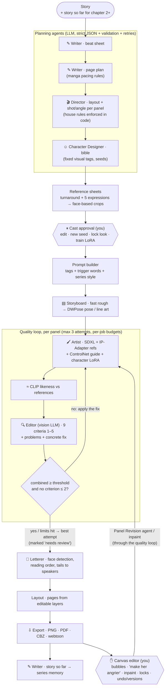

# Story to Manga

Paste a short story. A team of AI agents turns it into black-and-white manga pages, and you
watch, judge and change every step:

- a **Writer** plans beats and pages,
- a **Director** picks layouts and camera shots,
- a **Character Designer** writes a character bible and draws reference sheets you approve.

Then each panel is roughed out on a storyboard, drawn with the characters' references
(IP-Adapter, ControlNet, optional character LoRAs) and graded by a vision-LLM **Editor**, which
sends weak panels back for a redraw. A **Letterer** places the speech bubbles away from faces.
Finally you can edit everything on a canvas and export PNG, PDF, CBZ or a vertical webtoon.
Chapters of a series share the cast, the art style and a running "story so far".


## Quick start

Requirements: Python 3.11+, Node 20+. No API keys and no GPU needed (mock mode).

```bash
python scripts/tasks.py install   # or: make install
python scripts/tasks.py test      # or: make test    (all unit tests, mock mode, ~2 min)
python scripts/tasks.py dev       # or: make dev
```

Open http://localhost:3000 and either click **▶ Open the demo** (a finished 2-chapter series made
with the real pipeline; it loads instantly, with no GPU) or pick a sample story and click **Make my
manga**. API docs are at http://localhost:8000/docs.

Ports busy? `BACKEND_PORT=8300 FRONTEND_PORT=3300 python scripts/tasks.py dev` (PowerShell:
`$env:BACKEND_PORT=8300; $env:FRONTEND_PORT=3300` first).

Optional: `pip install -r backend/requirements-ai.txt` adds real **CLIP** consistency scores
(CPU only, ~1.2 GB download on first use). Without it a simple pixel score is shown (and it does not
vote in the Editor's pass/fail decision).

## The agent pipeline



- **Shared state.** All agents read and write one Pydantic object, `MangaProject`
  (`backend/app/agents/state.py`), saved as `output/<job>/project.json` after every step. That gives
  pause-for-approval, crash recovery and **resume** for free, and the editor works on the same file.
- **The graph.** A [LangGraph](https://langchain-ai.github.io/langgraph/) state graph
  (`agents/graph.py`, `agents/pipeline.py`); each node skips itself if its output already exists.
- **Structured outputs.** Every LLM agent answers with JSON matching a Pydantic schema
  (`agents/schemas.py`); validation errors are sent back for up to 2 retries (`agents/runner.py`).
- **The LLM proposes, code decides.** Pacing and camera rules, the pass/fail threshold, how a fix
  is applied, bubble placement and budgets are plain code, so they hold every time.
- **Agent trace.** Every step records inputs, output, retries, duration, tokens and cost; the Agent
  timeline shows them, with dedicated views for the beat sheet, page plan, Director, bible and the
  Editor's quality loop.

## What each feature does, and how to use it

### Quality loop (Editor agent)
After each panel is drawn, a **vision LLM** sees the panel plus the character reference images and
returns a strict grade sheet. It scores nine criteria from 1 to 5 (action, characters, people count,
likeness, shot/angle, emotion, anatomy, manga style, room for bubbles), gives pass/fail, lists the
problems, and proposes a **fix** that code can apply: prompt tags to add or remove, negative-prompt
additions, IP-Adapter weight, new seed. The grade is combined with the CLIP likeness score
(`agents/quality.py`):

```
editor   = mean((score − 1) / 4)                        0..1
clip     = (similarity − 0.60) / (0.90 − 0.60)          weakest character, clamped 0..1
combined = 0.7 · editor + 0.3 · clip
pass     = combined ≥ 0.65  and  no criterion ≤ 2  and  Editor verdict "pass"
```

Failed panels are redrawn with the fix, up to `EDITOR_MAX_ATTEMPTS=3`, within per-job budgets
(`JOB_MAX_LLM_CALLS`, `JOB_MAX_LLM_COST_USD`, `JOB_MAX_GPU_SECONDS`). When a limit is hit, the best
attempt is kept and marked **needs review**. Every attempt is stored. Open **Agent timeline → ★
Quality loop** (or `/jobs/<id>?tab=quality`) to see them side by side, with scores, the Editor's
reasoning and the fixes applied.

### Canvas editor (human in the loop)
**✎ Edit** tab (react-konva):

- **Bubbles, narration boxes and sound effects** are separate layers: drag, resize, edit the text,
  change the type (speech, thought, shout, narration, SFX), drag the orange dot to aim the tail,
  toggle vertical text. **Save page** re-renders the PNG/PDF/CBZ/webtoon.
- **Tell the director**: select a panel and type "make her angrier" or "camera from below". The
  **Panel Revision agent** rewrites the panel spec, and the panel is redrawn through the quality loop.
- **Inpainting**: paint over a region, say what should be there, and only that region is redrawn
  (with the character's reference when the region shows a character).
- **Locks**: a locked panel is never redrawn automatically. A locked character look can't be edited,
  and automatic fixes can't change its tags or reference strength (Cast page).
- **Versions**: every bubble save, redraw and inpaint is a version; **↶ / ↷** undo and redo, and
  each panel and page has a version list with **Restore**.

### Letterer
`agents/letterer.py` detects anime faces (`vision/faces.py`, OpenCV `lbpcascade_animeface`) and
measures how busy the art is, then places items in reading order (right-to-left by default):
narration first, dialogue in script order, then sound effects. Bubbles never cover faces when
there is room, and tails point at the speaker's face. The font auto-fits; Japanese/Chinese text is
set vertically (`LETTERING_VERTICAL=auto|on|off`). Fonts: Comic Neue and Bangers (SIL OFL, licences
in `backend/assets/fonts/`). Tick **Faces** in the editor to see what it avoided.

### Storyboard + ControlNet
For each panel the app draws a quick 768 px rough, extracts a **pose skeleton** (DWPose) or **line
art** from it, and the final panel follows that layout through **ControlNet**
(`CONTROLNET_STRENGTH=0.55`, guidance for the first 60% of the steps). The rough and the guide are
shown in the Quality loop. Without the ControlNet model or nodes the stage is skipped automatically.

### Character LoRA (optional)
On the **Cast** page, **⚙ Train character LoRA** builds a dataset from the approved references
(captions from the fixed tags plus a trigger word), trains an SDXL LoRA with kohya-ss sd-scripts in
the background (progress and logs shown; 8 GB settings in `training/lora.py`), and compares
consistency on test drawings without and with the LoRA. From then on panels use it automatically,
with IP-Adapter turned down. No local GPU? See **[CLOUD_TRAINING.md](CLOUD_TRAINING.md)** and
import the result. Without sd-scripts a mock trainer demonstrates the flow.

### Series and exports
Every manga is chapter 1 of a series (**Series** page). **Write chapter 2** reuses the approved
cast (tags, seeds, sheets, locks, LoRAs) and the series' art-style tags, and the Writer reads the
**story so far**, which it updates after every chapter. The Reader downloads PNG pages, a PDF, a
**CBZ** (with `ComicInfo.xml`, right-to-left) and a **webtoon** strip, and has a vertical
**Webtoon** view.

### Demo mode
`samples/demo/` holds a finished 2-chapter series made with the real pipeline
(`scripts/make_demo.py`). **▶ Open the demo** on the home page (or `POST /api/demo`) copies it into
the output folder and opens it, so presentations need no GPU and no keys.

## Providers

Settings live in `.env` at the repo root (copy `.env.example`; `.env` is git-ignored and keys are
never logged).

| | Provider | Set in `.env` |
|---|---|---|
| LLM 1 | Anthropic Claude (structured outputs, vision) | `ANTHROPIC_API_KEY` |
| LLM 2 | Google Gemini (JSON-schema mode, vision) | `GEMINI_API_KEY` |
| LLM 3 | Any OpenAI-compatible server (vision models for the Editor) | `OPENAI_BASE_URL` + `OPENAI_API_KEY` |
| LLM – | Mock (deterministic, offline; a simulated Editor) | nothing |
| Images | ComfyUI (auto-detected at `COMFYUI_URL`) | see SETUP_COMFYUI.md |
| Images – | Mock (placeholder art) | nothing |

The Editor needs a **vision-capable** model (Claude, Gemini, GPT-4o-class). Token use and cost are
counted per job; the Quality loop shows the budget meters. See PROGRESS.md for measured times and
the estimated cost per page.

## Running ComfyUI (real images, 8 GB GPU)

Follow **[SETUP_COMFYUI.md](SETUP_COMFYUI.md)**: ComfyUI + IP-Adapter Plus + controlnet_aux custom
nodes, and the models (Animagine XL 3.1, IP-Adapter Plus SDXL, CLIP-ViT-H, ControlNet union SDXL).
Every workflow was measured on an RTX 4060 Laptop (8 GB). Run `python -m app.tools.bench` (in
`backend/`) to measure your own GPU.

```bash
cd backend
.venv/Scripts/python -m app.tools.comfy_check             # nodes and models found
.venv/Scripts/python -m app.tools.comfy_check --generate  # one real test panel
.venv/Scripts/python -m app.tools.bench                   # time + peak VRAM of every workflow
```

## Tests

```bash
python scripts/tasks.py test                         # all unit tests, mock mode, no GPU/keys
cd backend && .venv/Scripts/python -m pytest tests/test_integration.py -s   # real end-to-end run
```

The integration tests skip themselves unless ComfyUI is reachable or an LLM key is set (the
LoRA one also needs sd-scripts). `scripts/ui_smoke.py` drives the editor in a real browser
(Playwright + the installed Edge/Chrome).

## API (main endpoints)

| Method | Path | |
|---|---|---|
| POST | `/api/jobs` | `{"story", "auto_approve"?, "project_id"?}` → job |
| GET | `/api/jobs/{id}` · `/project` | status / full agent state |
| POST | `/api/jobs/{id}/approve`, `/characters/{name}/approve` · `/regenerate` · PATCH `/characters/{name}` | cast approval |
| GET / PUT | `/api/jobs/{id}/pages/{p}/editor` · `/lettering` (+ POST `/lettering/reset`) | canvas editor |
| POST | `/api/jobs/{id}/panels/{p}/{n}/revise` · `/inpaint` · `/lock` | panel actions (queued on the GPU worker) |
| GET / POST | `/api/jobs/{id}/history` · `/history/undo` · `/redo` · `/restore` | versions |
| POST | `/api/jobs/{id}/characters/{name}/lock` · `/lora/train` · `/lora/import` | look lock, LoRA |
| GET | `/api/trainings/{id}` (+ POST `/cancel`) · `/api/training/info` | training progress + logs |
| GET / PATCH / POST | `/api/series` · `/api/series/{pid}` · `/api/series/{pid}/chapters` | series |
| GET / POST | `/api/demo` | demo mode |
| GET | `/api/layouts`, `/api/samples`, `/api/projects`, `/api/health`, `/files/{id}/...` | misc |

## Project layout

```
backend/app/agents/     writer, director, character designer, editor, revision, letterer, storyboard,
                        quality + redraw loop, history, series, inpaint, prompt builder, sheets, graph
backend/app/training/   LoRA dataset + kohya command + background trainer
backend/app/vision/     CLIP consistency score, anime face detection (+ cascade model)
backend/app/comfy/      ComfyUI client and workflow injection (IP-Adapter, ControlNet, LoRA)
backend/app/providers/  LLM (anthropic, gemini, openai-compatible, mock) + image (comfyui, hosted, mock)
backend/app/pipeline/   layout templates, lettering layers, masks, exports
backend/workflows/      ComfyUI workflow templates (txt2img, IP-Adapter, inpaint, preprocessors)
backend/assets/fonts/   Comic Neue + Bangers (OFL)
frontend/               Next.js: landing, series, job (progress, timeline + quality loop, cast, read, edit)
samples/                stories, demo bundle, outputs, benchmarks
comfyui/, tools/        local ComfyUI and sd-scripts installs (git-ignored)
PHASE_3_5_PLAN.md · PROGRESS.md · DECISIONS.md · SETUP_COMFYUI.md · CLOUD_TRAINING.md
```

## AI glossary

- **Agent**: an LLM call with a role, instructions and a strict output format. Agents hand work to
  each other through the shared state.
- **Structured output**: the LLM must return JSON in a given schema; we validate it and ask for fixes.
- **Vision LLM**: a language model that also reads images; the Editor uses one to grade panels.
- **Prompt tags / negative prompt**: comma-separated tags tell the diffusion model what to draw
  (earlier tags weigh more; `(tag:1.15)` adds weight); the negative prompt says what to avoid.
- **Seed**: the starting noise. The same seed, prompt and settings give the same image.
- **IP-Adapter**: turns a reference *image* into extra guidance, so the model draws someone who
  looks like that picture.
- **ControlNet**: a helper network that makes the drawing follow a *control image* (pose skeleton,
  line art) for layout.
- **LoRA**: a small add-on trained on a few images that teaches the model one new concept (a
  character), switched on by a trigger word.
- **Inpainting**: redrawing only the white area of a mask, leaving the rest pixel-identical.
- **CLIP similarity**: CLIP maps images to vectors; the cosine of the angle between two vectors
  measures how alike two pictures look.
- **Face detection (cascade)**: a fast classic detector that slides a window over the image and runs
  cheap pattern tests trained on anime faces.
